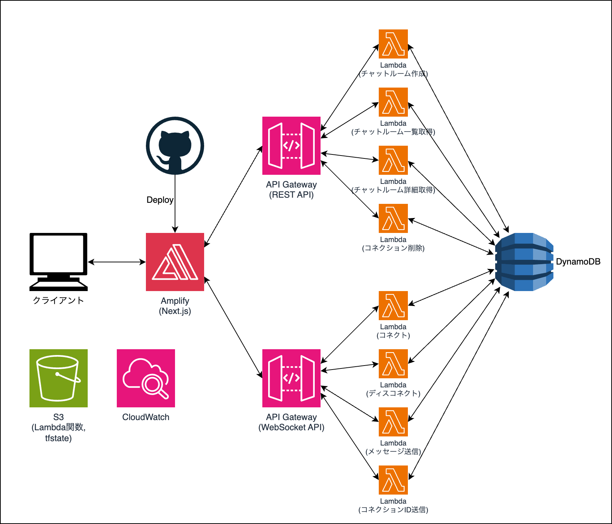
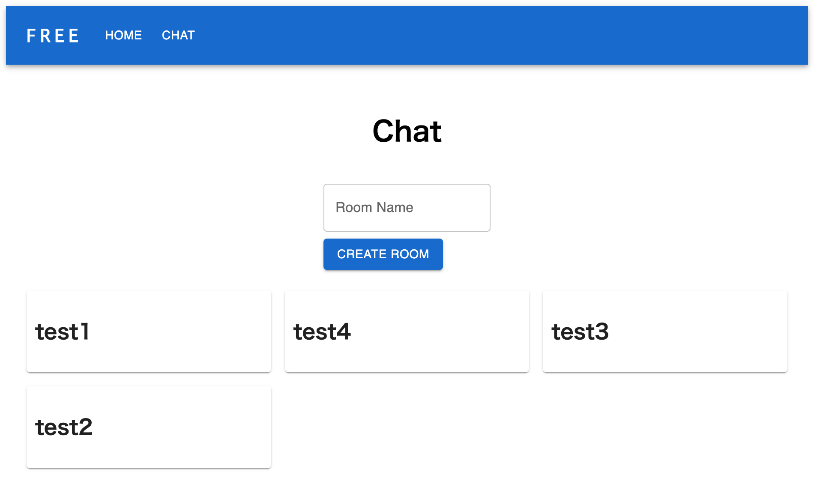
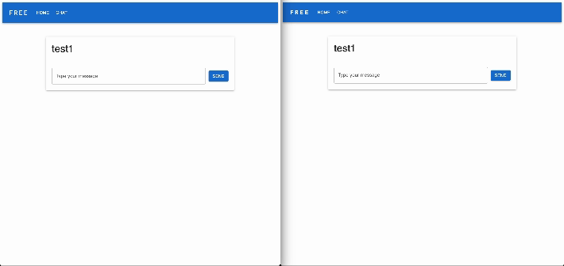

# amplify-chat-infrastructure

## 概要
- ソケット通信を使ったリアルタイムチャットのインフラです。
- フロントエンドのリポジトリ↓ 
https://github.com/yuji-sniper/amplify-chat-front

## 仕様技術
- AWS
    - API Gateway
        - WebSocket API
            - リアルタイムチャットのためのソケット通信。
        - REST API
            - その他のAPI。
    - Lambda（Python3.12）
        - 各APIのサーバー処理。
    - DynamoDB
        - チャットルーム、各ルームに接続されているコネクションIDを管理。
        - メッセージの保存はしてないです。投げ捨てになります。
    - Amplify
        - フロントエンド（Next.js）をホスト。

## システム構成図

## 画面
↓チャットルーム一覧で部屋を作成・選択

↓リアルタイムチャット

